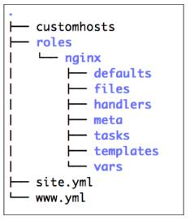

# Ansible Inventory

File inventory để giúp Ansible biết các server mà nó cần kết nối sử dụng SSH, thông tin kết nối nó yêu cầu và các tùy biến gắn liền với các server này.

File inventory sử dụng định dang INI hoawjc YAML, trong file này ta có thể chỉ định nhiều hơn 1 máy chủ hoặc gom chúng thành nhiều nhóm.

ví dụ file inventory ở định dạng INI:

---

mail.example.com

[webservers]
foo.example.com
bar.example.com

[dbservers]
one.example.com
two.example.com
three.example.com

---

hoặc định dạng YAML:

---

all:
hosts:
mail.example.com:
children:
webservers:
hosts:
foo.example.com:
bar.example.com:
dbservers:
hosts:
one.example.com:
two.example.com:
three.example.com:

---

# Modules:

# Task

# Playbook

---

- host: all
  remote_user: root
  vars:
  logstash_redis_host: 1.1.1.1
  logstash_redis_port: 5678
  logstash_redis_password: password
  beaver_version: 34.1.0
  logstash_namespace: logstash
  roles:
  - beaver

---

# Roles

# YAML
